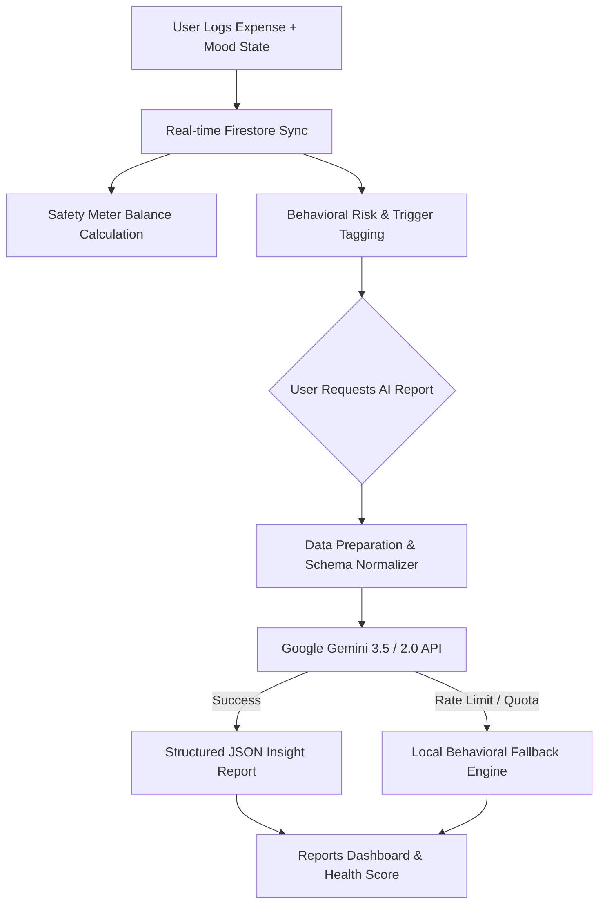

# 🧠 Psy-Fi — Mindful Personal Finance & Behavioral Tracker

> *Harmonizing money and mindset — track expenses, audit emotional spending, and gain deep AI-driven psychological financial insights.*


**Psy-Fi** is an AI-powered personal finance and behavioral economics platform. Unlike conventional budget apps that only track numbers, Psy-Fi bridges financial tracking with behavioral psychology — analyzing how emotions (stress, impulse, excitement, sadness) influence spending choices. Integrated with real-time Firebase services and Google's Gemini AI engine, Psy-Fi helps users achieve financial mindfulness and long-term habits.

---

## 📑 Table of Contents

- [✨ Key Features](#-key-features)
- [🔬 How It Works (Behavioral & AI Pipeline)](#-how-it-works-behavioral--ai-pipeline)
- [🏛️ Application Architecture](#️-application-architecture)
- [🛠️ Tech Stack](#️-tech-stack)
- [🚀 Getting Started](#-getting-started)
  - [Prerequisites](#prerequisites)
  - [Environment Setup](#environment-setup)
  - [Installation & Running Locally](#installation--running-locally)
- [🔐 Security & Firestore Rules](#-security--firestore-rules)
- [👑 Admin Console](#-admin-console)
- [📄 License](#-license)

---

## ✨ Key Features

- **💸 Mindful Expense Logging:** Log transactions with amount, category, payment source, purchase date, purchase reason, and **emotional state at purchase** (Happy, Stressed, Anxious, Impulsive, Neutral, etc.).
- **🛡️ Dynamic Financial Safety Meter:** Real-time calculation of safe discretionary balance, paid vs. unpaid fixed expenses, and overall budget allocation warnings.
- **📌 Fixed Expenses & Recurring Commitments:** Track recurring monthly bills (rent, subscriptions, EMIs). Toggle payment statuses dynamically to see instant impacts on discretionary budget.
- **📊 Emotional Spending & Risk Audits:** Automatic per-entry risk scoring (`Low`, `Medium`, `High`) and behavioral trigger detection to pinpoint emotional patterns.
- **🤖 Deep AI Insights (Google Gemini AI):**
  - **Financial Health Score (0–100):** Comprehensive score evaluating impulse control, category distribution, and emotional triggers.
  - **Behavioral Pattern Identification:** Identifies traits like *"Weekend Impulse Buyer"* or *"Stress-Induced Dining Out"*.
  - **Anomaly Detection:** Flags out-of-character large transactions with actionable recommendations.
  - **Personalized Suggestions:** Empathetic, culturally aware (INR ₹ currency native) recommendations for the week.
  - **Resilient Fallback Engine:** Built-in demo analysis fallback if AI API quotas are exceeded.
- **👑 Built-in Admin Console:** Comprehensive admin tools to manage registered users, monitor audit logs, update global category settings, and publish system changelogs.

---

## 🔬 How It Works (Behavioral & AI Pipeline)



1. **Transaction & Emotion Logging:** Every purchase is captured alongside the user's emotional state and contextual reason.
2. **Real-time Balance & Safety Computation:** The system computes discretionary spending against total budget and paid fixed expenses.
3. **Real-time Micro-Tagging:** Synchronous heuristic rules evaluate immediate transaction risk level.
4. **On-Demand Portfolio AI Analysis:** When requested, user transaction history is formatted into an LLM-optimized JSON payload and sent to **Google Gemini AI** for deep psychological profiling.

---

## 🏛️ Application Architecture

```text
Psy-Fi/
├── public/                    # Static branding and assets
├── src/
│   ├── components/            # React UI components
│   │   ├── AdminDashboard.tsx      # Admin stats & audit logs
│   │   ├── AdminRoute.tsx          # RBAC Route Guard for Admins
│   │   ├── Auth.tsx                # Authentication (Login/Register)
│   │   ├── BehavioralHistory.tsx   # Mood breakdown & emotional history
│   │   ├── ChangelogPage.tsx       # System updates & release notes
│   │   ├── Dashboard.tsx           # Main user dashboard container
│   │   ├── ExpenseTracker.tsx      # Add & view discretionary expenses
│   │   ├── FixedExpenses.tsx       # Manage recurring monthly rules
│   │   ├── GlobalSettingsManager.tsx # Admin category & payment source management
│   │   ├── ReportsDashboard.tsx    # AI insights & report view
│   │   ├── SafetyMeter.tsx         # Real-time safe balance visualizer
│   │   └── UserManagement.tsx      # Admin user roles & account controls
│   ├── hooks/
│   │   ├── useAuth.tsx             # Firebase Auth context & user role hook
│   │   └── useBalance.ts           # Real-time budget & balance hook
│   ├── lib/
│   │   ├── firebase.ts             # Firebase init, Firestore client, & TypeScript types
│   │   └── insightEngine.ts        # Per-entry real-time risk tagging engine
│   ├── services/
│   │   └── geminiInsightService.ts # Google Gemini AI integration & report builder
│   ├── App.tsx                     # React Router 7 navigation & guards
│   ├── main.tsx                    # React application root entry
│   └── index.css                   # Global CSS & Tailwind configuration
├── firestore.rules            # Security rules for Firestore collections
├── tailwind.config.js         # Tailwind styling design tokens
├── vite.config.ts             # Vite build configuration
└── package.json               # Application dependencies & scripts
```

---

## 🛠️ Tech Stack

| Domain | Technology |
| :--- | :--- |
| **Frontend Framework** | React 18 (TypeScript), React Router 7 |
| **Styling & UI** | Tailwind CSS, Lucide React Icons, Custom Glassmorphism Theme |
| **State & Data Handling** | React Hooks, Context API |
| **Database & Auth** | Firebase (Auth & Firestore Real-time Database) |
| **Artificial Intelligence** | `@google/genai` (Google Gemini 3.5 / 2.0 AI SDK) |
| **Build & Tooling** | Vite 5, PostCSS, ESLint, TypeScript 5.5 |

---

## 🚀 Getting Started

### Prerequisites

Ensure you have the following installed on your machine:
- **Node.js** (v18.0.0 or higher)
- **npm** or **yarn**
- A **Firebase Project** (with Auth & Firestore enabled)
- A **Google Gemini API Key** (from [Google AI Studio](https://aistudio.google.com/))

---

### Environment Setup

Create a `.env` file in the root directory:

```env
# Firebase Configuration
VITE_FIREBASE_API_KEY=your_firebase_api_key
VITE_FIREBASE_AUTH_DOMAIN=your_project.firebaseapp.com
VITE_FIREBASE_PROJECT_ID=your_project_id
VITE_FIREBASE_STORAGE_BUCKET=your_project.appspot.com
VITE_FIREBASE_MESSAGING_SENDER_ID=your_messaging_sender_id
VITE_FIREBASE_APP_ID=your_app_id

# Google Gemini AI Key
VITE_GEMINI_API_KEY=your_gemini_api_key
```

---

### Installation & Running Locally

1. **Clone the repository:**
   ```bash
   git clone https://github.com/maithiligosavi/Psy-Fi.git
   cd Psy-Fi
   ```

2. **Install dependencies:**
   ```bash
   npm install
   ```

3. **Start the development server:**
   ```bash
   npm run dev
   ```
   *The application will launch at `http://localhost:5173`.*

4. **Build for production:**
   ```bash
   npm run build
   ```

---

## 🔐 Security & Firestore Rules

Psy-Fi uses role-based access control (RBAC). Firestore rules enforce strict data access boundaries:
- **`audit_entries` & `fixed_rules`:** Users can read, create, update, and delete only their own documents (`user_id == request.auth.uid`).
- **`profiles`:** Users can manage their own profile; admins have global read/write access.
- **`global_settings`:** Admin-only write access for spending categories and payment sources.

---

## 👑 Admin Console

Users assigned the `admin` role in Firestore gain access to dedicated administration screens at `/admin`:
- **Admin Dashboard (`/admin`):** High-level view of app usage, overall spending breakdown, and audit entry feeds.
- **User Management (`/admin/users`):** Manage user roles (`user` vs `admin`) and inspect active accounts.
- **Global Settings (`/admin/settings`):** Add, edit, or disable categories and payment sources system-wide.
- **Release Notes (`/changelog`):** Track system version changes and feature deployments.

---

## 📄 License

Distributed under the **MIT License**. See [`LICENSE`](LICENSE) for details.
